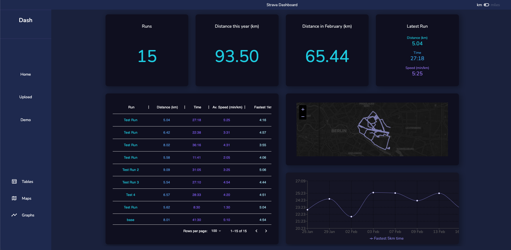

# Strava Dashboard

A dashboard application that pulls data from the Strava API and displays the data in widgets. 

The main aim was to create the functionality of Training Peaks - an application that lets you view your progression of fastest times through time.

Accessing the Strava API's "best efforts" data, we can compare these in graphs and tables.

## The Dashboard

## Environment Variables

To run this project, you will need to add the following VITE environment variables to your .env file.

`VITE_CLIENT_SECRET`

`VITE_CLIENT_ID`

